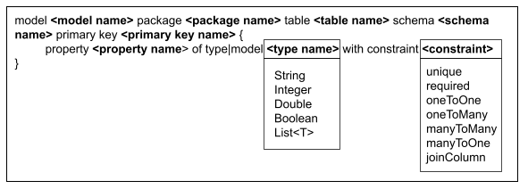
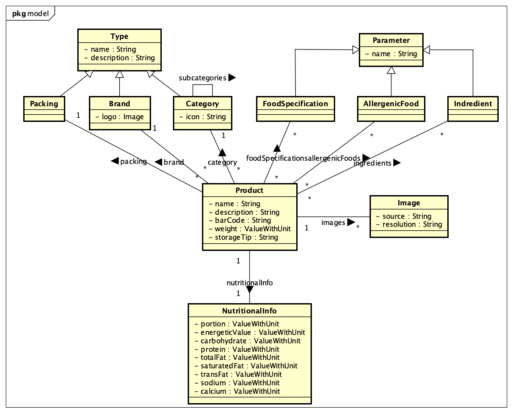

UNIVERSIDADE FEDERAL DO RIO GRANDE DO NORTE

PROGRAMA DE PÓS-GRADUAÇÃO EM TECNOLOGIA DA INFORMAÇÃO

LINGUAGENS DE DOMÍNIO ESPECÍFICO


**TRABALHO FINAL**


Talison Fernandes Costa

Honoré Vicente Cesário


**NATAL**

**FEVEREIRO/ 2021**

**Objetivos** 


O objetivo da linguagem APILang é gerar as classes de modelo de uma API, com anotações JPA (Java Persistence Application), a partir das especificações de restrições e relacionamentos definidas nos requisitos da aplicação. A linguagem deve servir para descrever o domínio de uma API e gerar a versão inicial das classes de modelo.

**Motivação**

O Diagrama de Classe (DC) permite especificar as propriedades e métodos de um determinado modelo, porém não fornece meios para descrever restrições de banco, e validação de dados. Tais limitações são supridas por outras ferramentas, como diagrama Entidade Relacionamento (ER) e documentos de especificação de requisitos.

No contexto de sistemas orientados a objetos, o uso de ferramentas ORM (Object-Relational Mapping) é comum para abstrair os detalhes de como o modelo está sendo representado no banco de dados. As informações de como o modelo será mapeado no banco é adicionado na própria classe por meio do uso de anotações. A principal especificação ORM é o JPA (Java Persistence Application), que fornece uma conjunto de anotações para especificações de restrições de banco e relacionamentos. Neste contexto, a APILang fornece um meio de descrever o modelo de dados agregando informações do diagrama de classe, diagrama de entidade relacionamento e documento de especificação de requisitos.

Além de servir como uma ferramenta de documentação e projeto de modelo de dados, a APILang aproxima a implementação do modelo de uma API da especificação, podendo através do uso de uma linguagem mais "natural" descrever os requisitos e, a partir daí, gerar os modelos da API sem necessariamente compreender a fundo a especificação JPA.


**Contexto**

Seria utilizada dentro de um ambiente de desenvolvimento (fábrica de software, por exemplo), por engenheiros de requisitos, para descrever modelos de dados com restrições de banco, validação de entrada, e definição de relacionamentos.

Através do uso dessa linguagem, um engenheiro de requisitos, gerente de projeto ou o próprio especialista do domínio, poderia fazer a especificação/descrição ou até mesmo prototipar o modelo de dados, gerando com isso uma maior flexibilidade no processo inicial de desenvolvimento, facilitando também o processo de entendimento dos requisitos necessários pela equipe de desenvolvimento.


**Implementação**


A linguagem foi projetada para ser usada por arquitetos de software para auxiliar na etapa de levantamento de requisitos, onde poderá incluir informações de restrições de dados e relacionamentos. O arquiteto pode especificar que determinada propriedade não pode ser vazia usando a palavra chave **required**, bem como definir a propriedade como única, com a palavra chave **unique**. A linguagem possui um subconjunto dos tipos primitivos básicos da linguagem Java, a Figura 1 mostra a estrutura geral da linguagem APILang.

O tipo de uma propriedade pode ser primitivo, neste caso a propriedade deve ser definida com **property <name> of type <type name>**, ou derivado de outro modelo, **property <name> of model <model name>.**



Figura 1: Estrutura da linguagem APILang.

As restrições aceita pela linguagem são:

- **unique** - define a propriedade com valor único, o código gerado vai anotar a propriedade com @Column(unique = true), criando uma restrição de banco que impede a repetição de dados para esta propriedade.
- **required** - define a propriedade como obrigatório, logo não será possível salvar os dados sem definir um valor para esta propriedade. O código gerado vai anotar a propriedade como @NotNull.
- **oneToOne** - define um relacionamento de um para um entre dois modelos, @OneToOne.
- **oneToMany** - define um relacionamento de um para muitos entre dois modelos, @OneToMany.
- **manyToMany** - define um relacionamento de muitos para muitos entre dois modelos, @ManyToMany.
- **manyToOne** - define um relacionamento de muitos para um entre dois modelos, @ManyToOne.
- **joinColumn** - define detalhes de uma coluna com a anotação @JoinColumn.

O código gerado contém todos os métodos **getters** e **setters** do modelo, e será criado no caminho especificado em tempo de execução. Para compilar o programa, executar o seguinte comando:

```
java -cp classes:libs/antlr-4.9.1-complete.jar apilang.EvalVisitor <caminho do programa \*.api> <caminho do repositório onde será criado o código>
```

**Gramática da linguagem**

```
grammar APILang;

prog: model+ EOF ;

model: 'model' NAME                          # modelName

| model 'package' PACKAGE\_NAME              # modelPackageName

| model 'table' NAME                        # modelTableName

| model 'schema' NAME                       # modelSchemaName

| model 'primary key' NAME                  # modelPrimaryKeyName

| model '{' property+ '}'                   # modelProperties

;

property: 'property' NAME                     # propertyDef

| property 'of type' TYPE                   # primitiveTypeDef

| property 'of model' NAME                  # definedModelDef

| property 'with constraint' constraints+   # constraintsDef

;

constraints: 'required' | 'unique' | 'oneToMany' | 'manyToMany' | 'manyToOne' | 'oneToOne' | 'joinColumn' ;

TYPE: 'String' | 'Integer' | 'Boolean' | 'Double' | 'List<'NAME'>' ;

NAME: [a-zA-Z\_]+ ;

PACKAGE\_NAME: [a-zA-Z.]+ ;

WS : [ \t\r\n]+ -> skip ;
```

Exemplo de um programa que define o modelo “Categoria”:

```
model Category package br.com.fotonica.apilangtest.model table category schema public primary key id\_category {** 

  **property subcategory of type List<Category>**

  **property isCategory of type Boolean**

  **property icon of type String**

}
```

O código gerado será: 

```
// Arquivo CategoriaModel.java**

package br.com.fotonica.apilangtest.model;

import javax.persistence.AttributeOverride;

import javax.persistence.Column;

import javax.persistence.Table;

import java.util.List;


import br.com.fotonica.core.GenericEntity;

@Table(name = "category", schema = "public")

@AttributeOverride(name = "id", column = @Column(name = "id\_category"))

public class CategoryModel extends GenericEntity {

private List<CategoryModel> subcategory;

private Boolean isCategory;

private String icon;


public List<CategoryModel> getSubcategory(){

  return this.subcategory;

}

public void setSubcategory(List<CategoryModel> subcategory){

  this.subcategory = subcategory;

}

public Boolean getIsCategory(){

  return this.isCategory;

}

public void setIsCategory(Boolean isCategory){

  this.isCategory = isCategory;

}

public String getIcon(){

  return this.icon;

}

public void setIcon(String icon){

  this.icon = icon;

}

}
```

Conforme pode ser visto no código gerado, não necessariamente as restrições devem ser especificadas. Esta flexibilidade foi pensada para permitir que o arquiteto possa definir as propriedades do modelo durante o levantamento de requisitos e depois refine a descrição do modelo numa etapa seguinte. A definição do nome da tabela, schema e chave primária também é opcional. Neste caso, o programador pode adicionar tais informações direto no código gerado.

**Implementação da linguagem**

A implementação do compilador encontra-se dentro do diretório **src/main** e os arquivos de programa para teste em **src/resources**. Ver os arquivos de teste **api1.api** e **api2.api**.

Para testar a geração de código, escrevemos um programa para especificar as classes de domínio do modelo mostrado na Figura 2.



Figura 2: Diagrama de domínio de uma api de produtos.

```
model UnitMeasurement package br.com.fotonica.apilangtest.model table unit\_measurement schema public primary key id\_unit\_measurement {

  property initials of type String

  property name of type String

}

model ValueWithUnit package br.com.fotonica.apilangtest.model table value\_with\_unit schema public primary key id\_value\_with\_unit { 

  property value of type Double

  property unitMeasurement of model UnitMeasurement

}

model Category package br.com.fotonica.apilangtest.model table category schema public primary key id\_category { 

  property subcategory of type List<Category>

  property isCategory of type Boolean

  property icon of type String

} 

model Brand package br.com.fotonica.apilangtest.model table brand schema public primary key id\_brand { 

  property name of type String

  property description of type String

}

model Packing package br.com.fotonica.apilangtest.model table packing schema public primary key id\_packing { 

  property name of type String

  property description of type String

}

model NutritionalInfo package br.com.fotonica.apilangtest.model table nutritional\_info schema public primary key id\_nutritional\_info {

  property portion of model ValueWithUnit with constraint oneToOne joinColumn

  property energeticValue of model ValueWithUnit with constraint oneToOne joinColumn

  property carbohydrate of model ValueWithUnit with constraint oneToOne joinColumn

  property protein of model ValueWithUnit with constraint oneToOne joinColumn

  property totalFat of model ValueWithUnit with constraint oneToOne joinColumn

  property saturatedFat of model ValueWithUnit with constraint oneToOne joinColumn

  property transFat of model ValueWithUnit with constraint oneToOne joinColumn

  property sodium of model ValueWithUnit with constraint oneToOne joinColumn

  property calcium of model ValueWithUnit with constraint oneToOne joinColumn

}

model Product package br.com.fotonica.apilangtest.model table product schema public primary key id\_product { 

  property name of type String with constraint unique

  property description of type String

  property barCode of type String

  property weight of model ValueWithUnit

  property storageTips of type String

  property category of model Category 

  property packing of model Packing

  property nutritionalInfo of model NutritionalInfo

}
```

Este trecho de código encontra-se disponível em: **src/resources/api1.api**. 

Executando o comando **java -cp classes:libs/antlr-4.9.1-complete.jar apilang.EvalVisitor src/resources/api1.api** o compilador gerou os seguintes arquivos:

- BrandModel.java
- CategoryModel.java
- NutritionalInfoModel.java
- PackingModel.java
- ProductModel.java
- UnitMeasurementModel.java
- ValueWithUnitModel.java

O conteúdo destes arquivos pode ser visto em **src/resources/output**.

**Funcionalidades**

A APILang apresenta como funcionalidade a geração de código do modelo de dados em Java com anotações JPA. O código em APILang possui uma sintaxe próxima da linguagem natural, e agrega informações dos modelos de dados especificados em UML através do Diagrama de Classe (DC), e do diagrama Entidade Relacionamento (ER). Portanto, especificando o modelo em APILang, o analista consegue reunir num mesmo arquivo informações de relacionamentos, restrições de banco e validações de dados, eliminando a necessidade do uso do diagrama ER e DC.

**Trabalhos futuros**

Para trabalhos futuros a APILang deve suportar a geração de código das classes controle para especificação das interfaces da API, das classes de serviços para interagir com o banco de dados, e documentação da API em OpenAPI.

